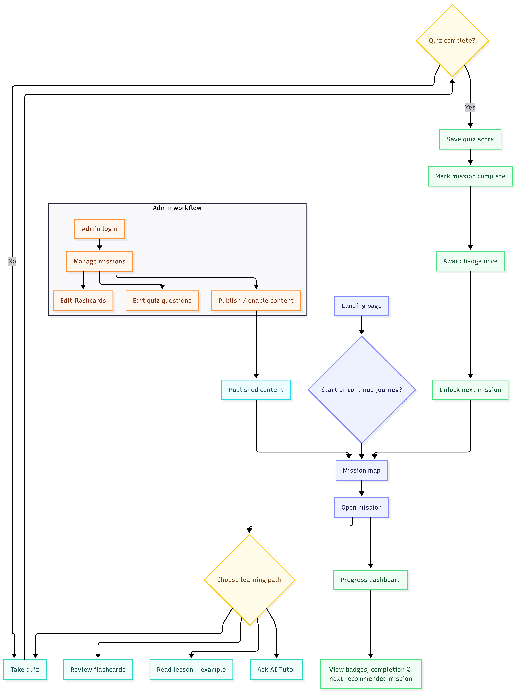

# AI Learning Adventure

A gamified AI literacy app built with Next.js and SQLite. Learners move through short missions, answer quiz checkpoints, review flashcards, collect badges, and ask an AI tutor for guidance without needing a login or complicated setup.



## Overview

AI Learning Adventure is designed to help beginners learn practical AI concepts in a gentle, structured way:

- prompts and LLM basics
- hallucinations, bias, and reliability
- tokens and context windows
- retrieval-augmented generation (RAG)
- responsible AI usage and builder mindset

The experience is intentionally simple:

1. A learner lands on the homepage.
2. They start a journey and browse a mission map.
3. Each mission includes learning content, a practical example, flashcards, and a quiz.
4. Progress is stored per browser session in SQLite.
5. Completion unlocks the next checkpoint and a badge.
6. The tutor can explain concepts, help with quiz questions, or recommend the next mission.

## Core product flow

```text
User -> Landing Page
      -> Mission Map
      -> Mission Detail
      -> Quiz / Flashcards / Tutor
      -> Progress Saved
      -> Badge Awarded
      -> Continue Journey
```

## What this app includes

### Learner experience

- Homepage with a guided entry and AI tutor prompt bar
- Mission map with ordered progression and completion tracking
- Per-mission lesson content with practical scenarios
- Quiz checkpoints with answer explanations
- Flashcard review for concept reinforcement
- Progress and badge tracking in the browser session
- AI tutor with a safe mock fallback when no API key is configured

### Admin experience

- Admin passcode gate
- Mission CRUD management
- Quiz and flashcard editing tied to the mission
- Draft vs published status controls
- Content visibility rules to prevent unpublished items from reaching learners

### Technical foundation

- Next.js 16 App Router
- React 19
- Tailwind CSS styling
- SQLite database with `better-sqlite3`
- Local session persistence with Zustand
- Server-side API routes for missions, progress, quizzes, flashcards, badges, and the tutor
- Groq-based AI tutor integration with graceful fallback to mock responses

## Project structure

```text
.
├── data/                     # SQLite database files
├── public/                   # Static assets and flowchart image
│   └── flowchart.png
├── scripts/
│   └── seed.ts               # Populates the database with mission content
├── src/
│   ├── app/                  # App Router pages and API routes
│   │   ├── admin/
│   │   ├── ai-tutor/
│   │   ├── api/
│   │   ├── missions/
│   │   ├── progress/
│   │   ├── globals.css
│   │   ├── layout.tsx
│   │   └── page.tsx
│   ├── components/           # UI and content components
│   ├── lib/
│   │   ├── ai/               # Tutor provider and mock responses
│   │   ├── store/            # Zustand session state
│   │   ├── admin-auth.ts     # Passcode + admin cookie validation
│   │   ├── db.ts             # SQLite connection setup
│   │   ├── repo.ts           # Data access layer
│   │   ├── schema.sql        # DB schema
│   │   ├── seed-data.ts      # Mission content seed dataset
│   │   ├── types.ts          # Shared TS types
│   │   └── utils.ts
│   └── ...
├── .eslintrc / config files
├── package.json
├── README.md
├── next.config.ts
├── tsconfig.json
└── postcss.config.mjs
```

## App flow in plain language

The app follows a simple learning loop:

- A mission is published to the learner-facing mission map.
- The learner opens the mission and reads a short lesson.
- The learner asks questions to the tutor or reviews flashcards.
- The learner completes a checkpoint quiz.
- The system marks progress and awards the matching badge.
- The next mission becomes available in sequence.
- Progress is persisted and can be revisited later.

## Data model

The app stores structured learning content in SQLite:

- `missions`: title, slug, level, content, objective, scenario, publication state
- `quiz_questions`: question text, answer choices, correct answer, explanation
- `flashcards`: concept and explanation cards
- `badges`: mission-level rewards and metadata
- `progress`: learner session completion state
- `badges_earned`: awarded badge history

This makes the app easy to extend with new missions or additional content without changing the app shell.

## AI tutor behavior

The tutor route uses a single shared provider in `src/lib/ai/provider.ts`:

- If `GROQ_API_KEY` is present, it calls Groq with a mission-aware system prompt.
- If the key is missing, the request times out, or the API fails, it automatically falls back to a mock response.
- The app still works without any external AI credentials.

This design keeps the product usable in demo and local development environments while remaining easy to connect to a real model later.

## Admin setup

To access the admin area, visit the admin page and use the passcode from the environment variable:

```bash
ADMIN_PASSCODE=your-passcode
ADMIN_COOKIE_SECRET=your-secret
```

If you do not set them, the app defaults to:

- `ADMIN_PASSCODE=adventure-admin`
- `ADMIN_COOKIE_SECRET=dev-only-secret-change-me`

This is intended for local development and demos, not for production security.

## Local development

### Install dependencies

```bash
npm install
```

### Seed the content database

```bash
npm run db:seed
```

### Start the app

```bash
npm run dev
```

Then open:

```text
http://localhost:3000
```

### Production build

```bash
npm run build
```

### Start production server

```bash
npm run start
```

## Environment variables

The app is built to run without environment configuration, but these are supported:

```bash
GROQ_API_KEY=your_api_key_here
GROQ_MODEL=llama-3.1-8b-instant
ADMIN_PASSCODE=adventure-admin
ADMIN_COOKIE_SECRET=dev-only-secret-change-me
```

## Recommended learning path

For a first run, follow this path:

1. Open the landing page.
2. Start the journey from the mission map.
3. Complete `What is AI?` and `What is Generative AI?`.
4. Continue through prompt engineering and reliability topics.
5. Use the AI tutor to ask deeper questions about each mission.
6. Review the progress page to see earned badges and completed missions.

## Notes

This project is intentionally a polished local demo for AI literacy learning. It is designed to be easy to understand, easy to extend, and easy to run in a lightweight development environment.
